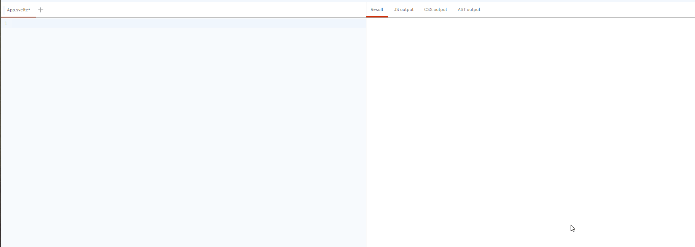

## Dom绑定事件

在svelte中，可以通过 `on:事件={}` 将Dom事件绑定到组件元素上。

```javascript

<!-- DOM绑定相关 -->

<script>
    function handlerClick(){
        console.log("hello world");
    }
</script>

<h1>使用 on:事件 控制dom元素行为</h1>
<button on:click={handlerClick}>button</button>
```

同时，svelte提供了一些modifiers用于改变DOM事件的默认事件。这些修饰符可以添加到事件上，提供了一种简便的方式处理一些常见行为而减少代码量。

例如以上代码元素修改为

```javascript
<button on:click|once|preventDefault={handlerClick}>btn2</button>
```

`click|`后面跟着的`once,preventDefault`都是修饰符，前者声明该事件只会被触发一次，后者将销毁元素的默认行为(例如a标签的跳转)

值得注意的是once修饰似乎会在一次触发后直接销毁掉整个监听行为，这导致触发一次之后，preventDefault将不起作用

## Svelte中的客制化事件

除了标准的DOM事件以外，你还可以监听由子事件发出的`客制化事件`

`createEventDispatcher` 是Svelte框架提供的一个组件。它用于在Svelte组件内部创建自定义事件。该函数允许一个组件向其父组件发送事件，这在组件间的通信非常有用且优雅

试想你可能有一个模态弹窗组件，希望在模态关闭的时候通知父组件，这可以通过发出一个

`closeModalEvent` 事件来优雅的实现

```javascript
// ModalComponent.svelte
<script>
  import { createEventDispatcher } from 'svelte';
  const dispatch = createEventDispatcher();

  function handleClose() {
    dispatch('closeModalEvent');
  }
</script>

<div class="modal">
  <!-- 模态内容 -->
  <button on:click={handleClose}>关闭</button>
</div>


```

## await block

在svelte中,await block是一种特殊的语法结构，用于处理异步操作，比如网络请求操作。这个特性使得在svelte应用中处理异步数据变得非常直观简便

例如在调用api的时候，我们可能想要做到这些事:

> 请求未处理完成时，我们希望有loading画面
> 
> 请求完成后，将回传的数据渲染到页面中
> 
> 请求错误时，提醒用户出错了!

在vue中需要大量变量来处理这些场景，在svelte中，提供了`await` block语法来简化这些操作，它的语法大致如下，在promise三个不同时态都会执行不同的渲染

```javascript
{#await api}
<span> loading... </span>
{:then response}
<span> {response} </span>
{:catch error}
<span> {error} </span>
{/await}
```

比如说，调用github的api

```javascript
<script>
	let api = fetch("https://api.github.com/users/meteorOSS").then(res => res.json())
</script>

{#await api}
<span>loading...</span>
{:then response}

<h2>{response.name}</h2>
{:catch error}
<h1>{error}</h1>
{/await}
```




