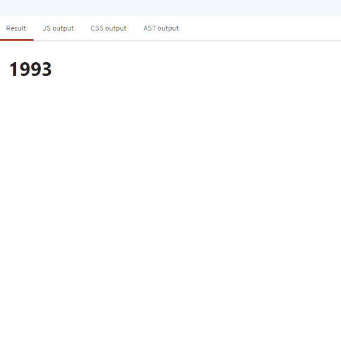
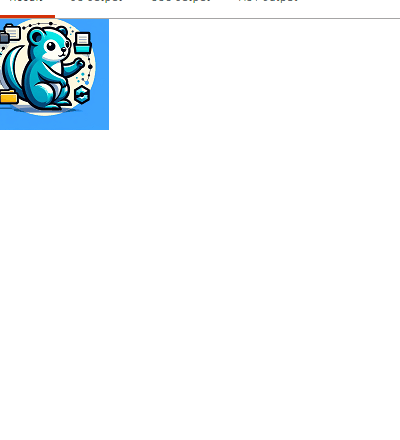
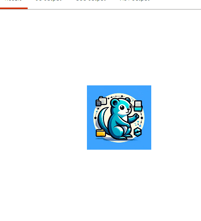

## Svelte当中的motion互动库

motion提供了一系列易于使用的工具和组件，帮助你在应用中实现各种交互动画

### tween

```javascript
function tweened<T>(
    value?: T | undefined,
    defaults?: TweenedOptions<T> | undefined
): Tweened<T>;
```

tween是一个用于创建平滑过渡效果的函数，常用于联系两个元素，比如进行渐变，移动，缩放等。通过tween函数，定义动画的起始与结束值，它会自动在这两个值之间创建平滑的过渡效果

```javascript
<script>
    import {tweened} from 'svelte/motion'
    import {onMount} from 'svelte'
    let name = 'world'
    let year = tweened(1990,{duration:3000})
    onMount(()=>{
        setTimeout(()=>{
            year.set(2020)
        },2000)
    })
</script>

<h1>{Math.floor($year)}</h1>
```

以上代码会在组件挂载2秒后，从1990年慢慢过渡到2020年。其中duration是可供选择的参数之一，它表示过渡持续的毫秒数，除此之外还有别的参数可供选择，以下

`delay` 开始过渡前等待的毫秒数

`duration` 过渡持续的毫秒数

`easing` 指定过渡函数 [svelte/easing • Docs • Svelte](https://svelte.dev/docs/svelte-easing) 



## spring

```javascript
function spring<T = any>(
        value?: T | undefined,
        opts?: SpringOpts | undefined
): Spring<T>;
```

spring也是svelte提供的一个动画库，它与tween的差别大概是后者通过在开始和结束之间进行数数值插值来创建动画效果，而spring基于物理原理，使用物理模型来模拟动画的运动与弹性效果

以一个例子来学习spring

```javascript
<script>
        let x;
        let y;
        let image;
        let imgUrl = "http://cdn.zsenhe.com/b09197b593314913af78bbfb46fc48c8"; 
        function handleMove(e){
                x = e.clientX - image.width/2;
                y = e.clientY - image.height/2;
        }
</script>

<style>
        img {
                /*脱离文档流方便移动*/
                position: absolute        
        }
</style>


```

这是一个简单的页面，它的作用是img标签会跟随鼠标进行移动，如图所示



看着呆呆的，我们可以使用spring让它更生动一点。改造一下代码

```javascript
<script>
        import {spring} from 'svelte/motion'
        let x;
        let y;
        let image;
        let imgUrl = "http://cdn.zsenhe.com/b09197b593314913af78bbfb46fc48c8"; 

        let position = spring({
                x: 0,
                y: 0,
        },{
                stiffness: 0.1,
                damping: 0.3,
        });
        function handleMove(e){
                position.set({
                        x: e.clientX - image.width/2,
                        y: e.clientY - image.height/2,
                })
        }

</script>

<style>
        img {
                /*脱离文档流方便移动*/
                position: absolute;
                color: red
        }
</style>


```

其中`stiffness`表示spring的刚性，将之理解于弹簧，如果弹簧很松弛(低刚度),它更容易受到外部力的影响，拉伸或压缩的程度相对较大;反之高刚度，它对压力的反应程度会更强，拉伸或压缩的程度较小

在动画中,stiffness属性类似控制了弹簧的刚度程度，较高的`stiffness`会让动画看起来更生硬和快速，反之较低的值会使动画看起来更加柔和和缓慢，因为弹簧的刚度降低，元素的运动就会更加缓慢柔和


