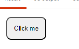
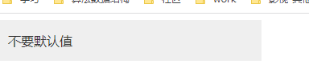
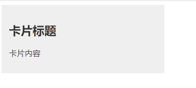

# class与slot插槽

## class:name

svelte提供了元素class的快速切换，使用 `class:name={isActive}`，其中isActive是一个布尔值，意义是是否携带这个class。下方代码实现了一个点击后变成浅蓝色的按钮

```javascript
<script>
        // 是否激活
        let active = false;
</script>
<style>
    button {
            padding: 14px;
            border-radius: 10px;
    }
    .active {
            background-color: lightblue
    }
</style>
<button class="btn" class:active={active} on:click={
        ()=> active = !active
}>
        Click me
</button>
```



其中，为什么要写成 `class:active={active}` 而不是 isActive 区分开呢.其实完全可以这样写 `class:active`,当两者命名相同时可以忽略后面的值

## slot

svelte中也有与vue类似的`slot`插槽，它允许在组件内部定义一个或多个插槽，并在使用该组件时，将内容插入到这些插槽中。

`card.svelte`

```javascript
<style>
    .card{
        background-color: #efefef;
        width: 300px;
        padding: 15px
    }
</style>

<div class="card">
    <slot>
        <p>default text</p>
    </slot>
</div>
```

在另一个组件中使用，并插入值

```javascript
<script>
    import Card from "./compent/Card.svelte";
</script>

<Card>不要默认值</Card>
```



它也允许多个`slot`，为卡片组件增加头部和内容部分插槽

```javascript
<style>
    .card{
        width: 300px;
        background-color: #efefef;
        padding: 15px;
    }
</style>

<div class="card">
    <slot name="card-head">
        <h2>card head</h2>
    </slot>
    <slot name="card-body">
        <p>card body</p>
    </slot>
</div>
```

```javascript
<script>
    import RichCard from "./compent/RichCard.svelte";
</script>

<RichCard>
    <h2 slot="card-head">卡片标题</h2>
    <p slot="card-body">卡片内容</p>
</RichCard>
```


