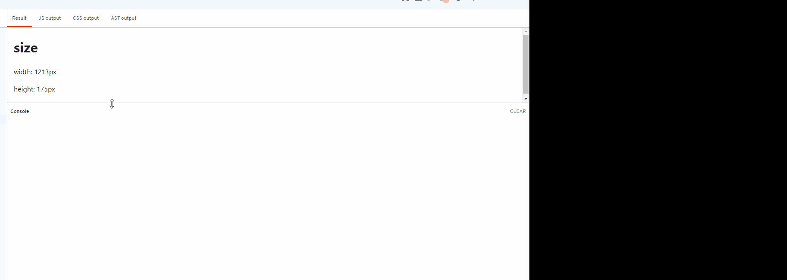
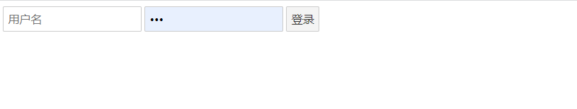

## 认识Svelte中Context与Store的用法 (1)

### 什么时候需要用到Store?

> 资料经常更新且可能跨组件使用
> 
> 不想掺杂太多业务逻辑在组件里
> 
> 想通过其他Library达到reactive效果

说到底，我们需要有一个统一的地方来保存数据，让这些数据能在不同的组件中共用

Svelte提供了三个Store API ，依照功能可分为 `readable` `writable` `derived`

#### 最常使用的 writable

它通过 `update` 或 `set` 从外部修改store的值

```javascript
<script>
	import {writable} from 'svelte/store'
	const countdown = writable(10)
	// update
	countdown.update((currentValue) =>{
		return currentValue-1;
	})
	// set
	countdown.set(9)
</script>
```

它们之间的差别仅是前者接收一个函数，其中可获取更新前的值;而set是单纯的覆盖新的值

### 只读Store: readable

`readable`是一种特殊的store，它允许你创建一个只读的响应式值。它与常规的store不同，它不允许直接修改其值。readbable通常用于包装外部数据源，例如来自WebAPI的数据

`readable`接收一个 `初始值` 和一个 `开始`函数，开始函数被调用时，应返回一个"停止"的逻辑，用于清理或断开数据源

在学到这里的时候有一些疑惑，以上是我细究之后的概念，听着仍然很抽象，更别提刚接触了。在群友的帮助下，我通过一个例子进行学习，现在我分享给诸位

上面提到readable通常用于封装和管理不应该由组件直接修改的外部数据源，这些数据源可能是定时更新的值，来自WebAPI的数据，或其他类型的只读数据

例如我们正在开发一个响应式的Svelte应用，并希望通过浏览器窗口的大小变动来调整布局。在学习了readable后，我们可以写出这样的代码:

```javascript
<script>
  import { readable } from 'svelte/store';

  const windowSize = readable(getWindowSize(), set => {
    function handleResize() {
      set(getWindowSize());
    }

    window.addEventListener('resize', handleResize);

    return () => {
      window.removeEventListener('resize', handleResize);
    };
  });

  function getWindowSize() {
    return {
      width: window.innerWidth,
      height: window.innerHeight
    };
  }
</script>

<h1>size</h1>
<p>width: {$windowSize.width}px</p>
<p>height: {$windowSize.height}px</p>

```

在这个例子中，`readable`存储被用来订阅浏览器窗口的大小变化。让我们来解析一下这段代码

1. 初始值

`getWindowsSize()`被调用来提供初始值。这个函数返回当前窗口的宽高，因此`windowSize`在创建时就有了一个代表当前浏览器窗口宽高的对象作为初始值。

2. start函数

`set`函数: Svelte提供的`set`函数用于更新存储的值，在这个例子中，它被用于设置新窗口的大小(再次调用getWindowsSize)

`handlerResize()`这是一个内部定义的函数，每当窗口变化时，它会被调用，在这个函数内，上面提到的 `set`被用于设置windowsSize的值

`事件监听器` 我们订阅了resize事件来监听窗口变化，当改变时触发 handlerResize() 来更新这个Store的值

最后实现的效果如下:

(黑屏好像是我的另外一块屏幕???录屏软件的问题)



另一个例子是我看的教程中提到的聊天室应用

### 整合多个Store: derived

待补充

### 怎么访问store的值?

所有的store都提供了subscribe()方法，其中接收一个回调函数，参数val返回store中的值

```javascript
	const vl = writable(10)
	vl.subscribe(val=>{
		console.log(val)
	})
```

在svelte中有更简便的方式访问store，只需在变量前加入 `$` 即可

```javascript
<span>{$vl}</span>
```

## 使用Store让业务逻辑和页面元素分离

上方提到 Store的应用场景很大一点是为了分离业务逻辑，那么在实际开发中怎么做这点呢?

答案是创建一个JS文件来定义和导出存储，并在需要的组件中import，以下是一个例子

我们定义一个 `userStore.js`作为登录存储，如下:

```javascript
// userStore.js
import { writable } from 'svelte/store';

export const user = writable(null); // 初始状态，用户未登录
export function login(username,password){
    user.set({username,password});
}
export function logout(){
    user.set(null);
}
```

界面 `app.svelte`

```javascript
<!-- Login.svelte -->
<script>
	import { login } from './store/userStore.js';
	import { user } from './store/userStore.js';
	let username = '';
	let password = '';
  
	function handleSubmit() {
	  login(username, password);
	}
  </script>
  
<main>
	{#if $user}
	<hd>欢迎你，{username}</hd>
	{:else}
	<form on:submit|preventDefault={handleSubmit}>
		<input type="text" bind:value={username} placeholder="用户名" />
		<input type="password" bind:value={password} placeholder="密码" />
		<button type="submit">登录</button>
	</form>
	{/if}
</main>
  
```

演示如下:


